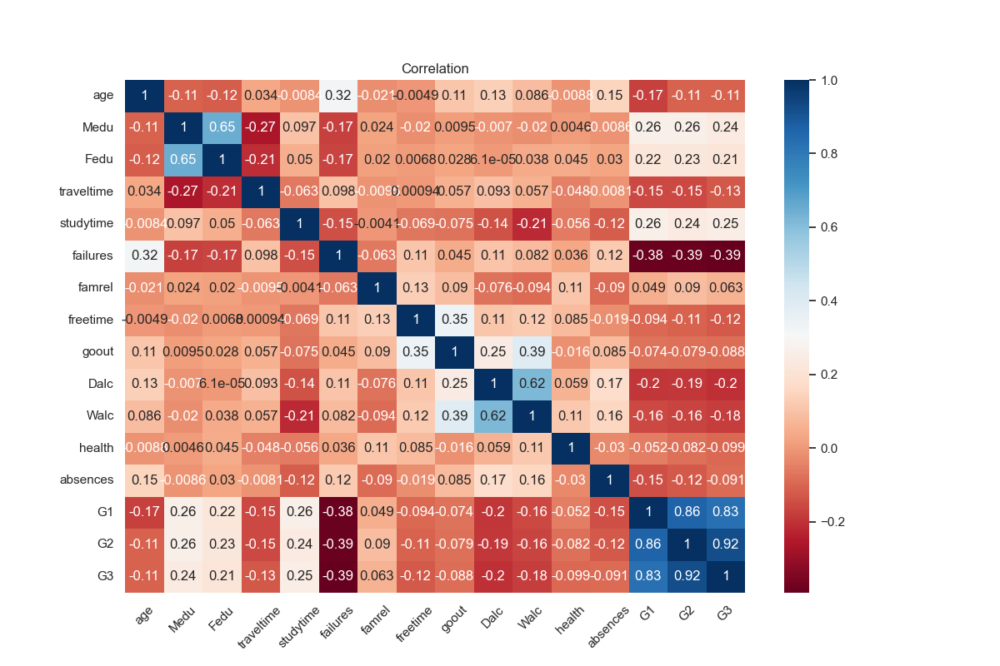
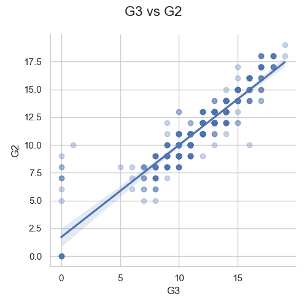
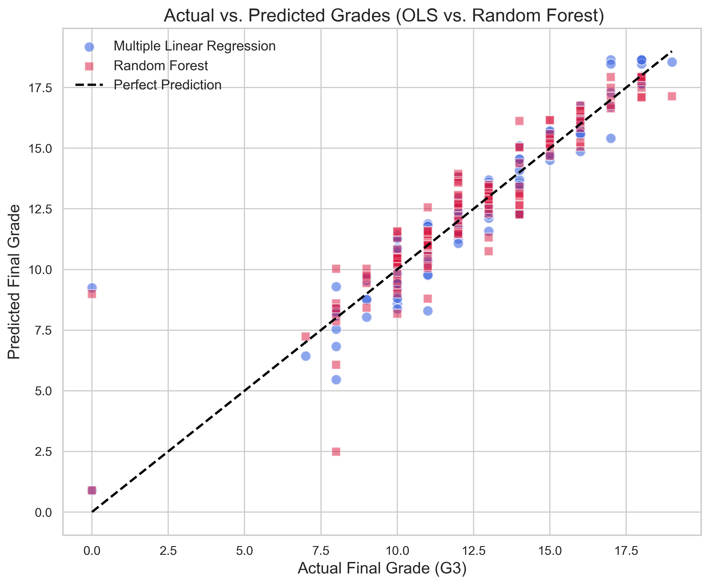
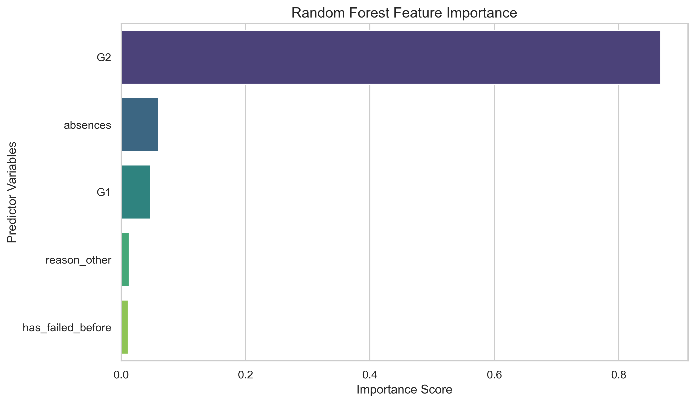

# Edulytics: Student Performance Analysis & Prediction

## Project Overview

Educational institutions often struggle to identify students at risk of poor academic performance before final examinations. This project leverages data analytics and machine learning to predict student final grades and uncover the key factors influencing academic success.

Using a dataset of 649 students, I developed and compared two predictive models:

* Multiple Linear Regression (MLR)
* Random Forest Regression (RF)

The objective was to determine which model provides the most accurate predictions while generating actionable insights for educational institutions.

---

## Business Problem

Traditional assessment methods are reactive and often identify struggling students too late for effective intervention.

This project aims to:

* Predict final student grades (G3)
* Identify the strongest predictors of academic performance
* Compare statistical and machine learning approaches
* Support the development of Early Warning Systems (EWS)

---

## Tools & Technologies

### Programming & Analysis

* Python
* Pandas
* NumPy

### Visualization

* Matplotlib
* Seaborn

### Machine Learning

* Scikit-Learn
* Statsmodels

### Development Environment

* Jupyter Notebook
* Visual Studio Code (VS Code)
* Git & GitHub

---

## Project Workflow

```text
Student Dataset
      ↓
Data Cleaning
      ↓
Exploratory Data Analysis
      ↓
Feature Engineering
      ↓
Train/Test Split
      ↓
Multiple Linear Regression
      ↓
Random Forest Regression
      ↓
Model Evaluation
      ↓
Business Recommendations
```

---

# Exploratory Data Analysis

## Correlation Analysis



### Insight

The correlation heatmap reveals that G1 (first-period grade) and G2 (second-period grade) have the strongest relationship with final academic performance (G3), highlighting the importance of academic momentum.

---

## Academic Momentum



### Insight

A strong positive relationship exists between second-period grades (G2) and final grades (G3), indicating that mid-term performance is a powerful predictor of future academic success.

---

# Model Development

Two predictive models were developed and compared.

## Multiple Linear Regression

The MLR model was refined using:

* Backward Elimination
* Variance Inflation Factor (VIF) Analysis
* Residual Diagnostics
* Durbin-Watson Testing

## Random Forest Regression

The Random Forest model was developed to:

* Capture non-linear relationships
* Evaluate feature importance
* Compare predictive performance against the linear model

---

# Model Performance

| Metric   | Random Forest | Multiple Linear Regression |
| -------- | ------------- | -------------------------- |
| R² Score | 0.8509        | **0.8667**                 |
| MAE      | 0.7551        | **0.7180**                 |
| RMSE     | 1.2600        | **1.1403**                 |

### Key Finding

Multiple Linear Regression outperformed Random Forest across all evaluation metrics, explaining approximately **86.7%** of the variation in final student grades.

---

## Actual vs Predicted Grades



### Insight

The Multiple Linear Regression model demonstrates strong predictive performance, with predicted grades closely matching actual student outcomes.

---

# Feature Importance



### Most Influential Predictors

1. G2 (Second Period Grade)
2. G1 (First Period Grade)
3. Student Absences
4. Previous Academic Failures

These findings indicate that academic momentum and attendance are the strongest drivers of student success.

---

# Strategic Recommendations

## Early Warning Systems

Implement predictive models within student management systems to identify at-risk students before final examinations.

## Attendance Monitoring

Use attendance data to trigger interventions when absenteeism begins negatively affecting academic performance.

## Targeted Student Support

Provide tutoring, mentoring, and counseling services to students identified as high-risk.

## Data-Driven Decision Making

Leverage predictive analytics to allocate educational resources more effectively and improve student outcomes.

---

# What I Learned

Through this project, I strengthened my skills in:

* Data Cleaning & Preprocessing
* Exploratory Data Analysis (EDA)
* Feature Engineering
* Multiple Linear Regression
* Random Forest Regression
* Model Evaluation (R², MAE, RMSE)
* Statistical Diagnostics
* Translating analytical findings into business recommendations

This project reinforced the importance of combining statistical analysis with machine learning techniques to solve real-world educational challenges.

---

# Conclusion

This project demonstrates how predictive analytics can be used to proactively identify students at risk of underperforming.

The analysis revealed that academic momentum, represented by G1 and G2 grades, is the strongest predictor of final academic success. While both models performed well, Multiple Linear Regression achieved the highest predictive accuracy and provides a strong foundation for educational Early Warning Systems.
